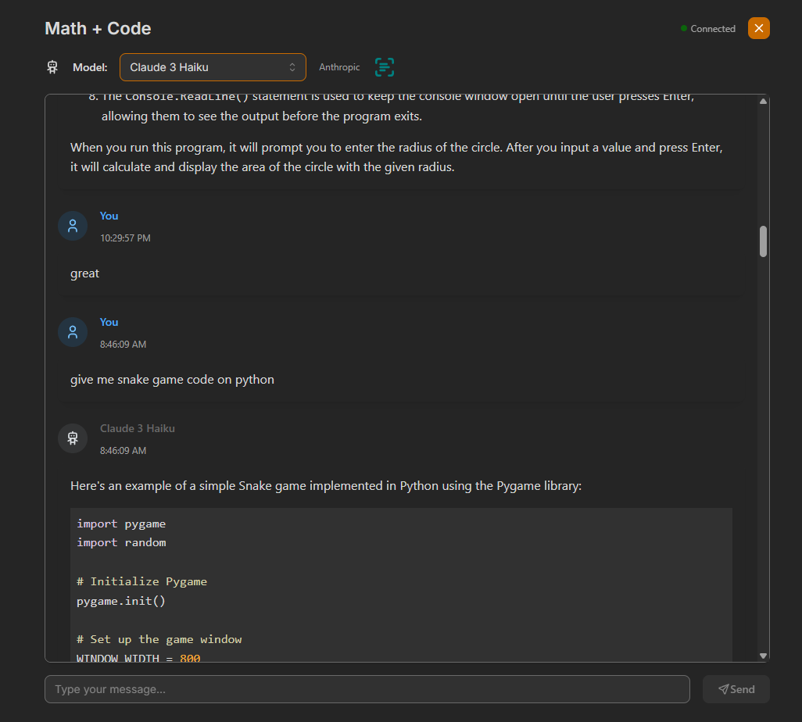
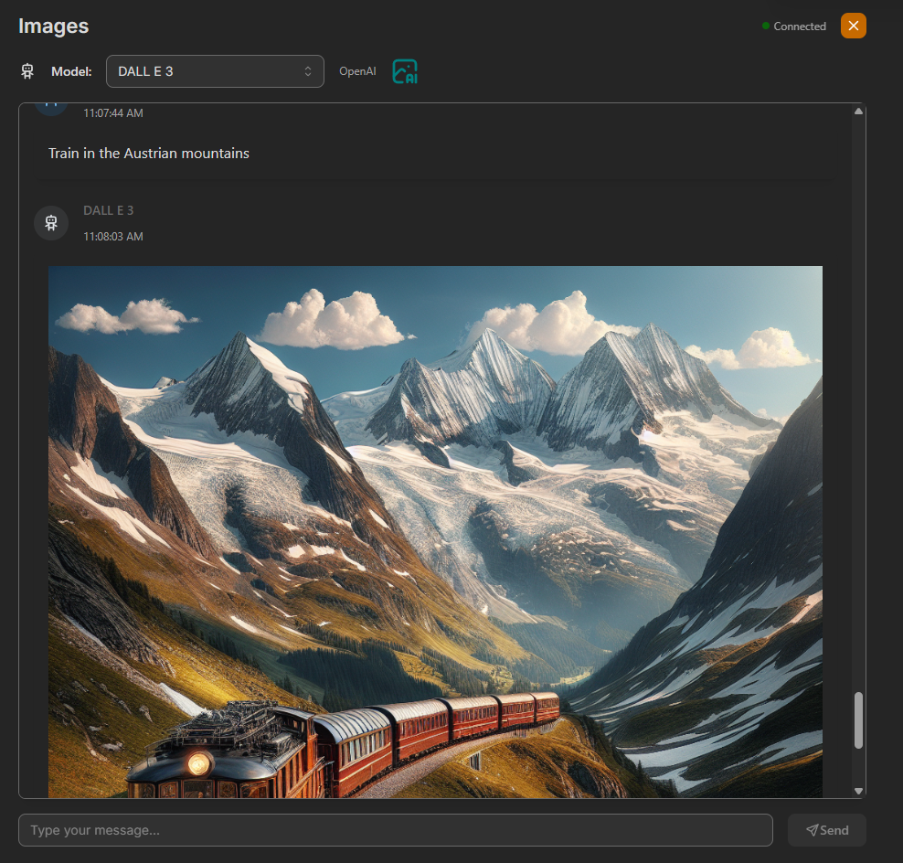
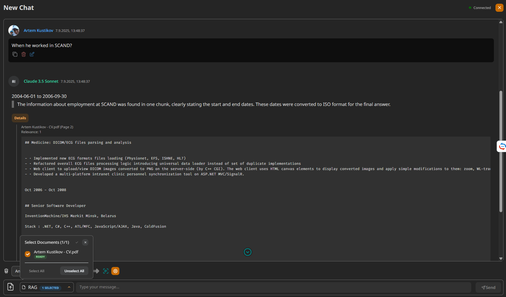

# KateChat - Universal AI Chat Interface

KateChat is a universal chat bot platform similar to chat.openai.com that can be used as a base for customized chat bots. The platform supports multiple LLM models from various providers and allows switching between them on the fly within a chat session.


## Features

- CI/CD pipeline with GitHub Actions to deploy the app to AWS
- Distributed messages processing using external queue (Redis), full-pfledged production-like dev environment with docker-compose
- User authentication (email/password, [Google OAuth, GitHub OAuth](/docs/oauth-setup.md))
- Real-time communication with GraphQL subscriptions
- Support for various LLM model Providers:
  - AWS Bedrock (Amazon, Anthropic, Meta, Mistral, AI21, Cohere...)
  - OpenAI
  - [Yandex Foundation Models](https://yandex.cloud/en/docs/foundation-models/concepts/generation/models) with OpenAI protocol 
- RAG implementation with documents (PDF, DOCX, TXT) parsing with [Docling](https://docling-project.github.io/docling/) and vestor embeddings stored in PostgreSQL/Sqlite/MS SQL server
- Demo mode when no LLM providers configured on Backend and `AWS_BEDROCK_...` or `OPENAI_API_...` settings are stored in local storage and sent to the backend as "x-aws-region", "x-aws-access-key-id", "x-aws-secret-access-key", "x-openai-api-key" headers
- Multiple chats creation with pristine chat functionality
- Chat history storage and management, messages editing/deletion
- Rich markdown formatting: code blocks, images, MatJAX formulas etc.
- "Switch model"/"Call other model" logic to process current chat messages with another model
- Parallel call for assistant message against other models to [compare results](#screenshots)
- Images input support (drag & drop, copy-paste, etc.), images stored on S3-compatible storage (`localstack` on localdev env)
- Responsive UI with Mantine

## 🚀 Live Demo

Experience KateChat in action with our live staging environment:

**[Try KateChat Demo →](https://katechat.tech/)**

### Demo Features
- ✨ Full-featured chat interface
- 🔄 Real-time model switching
- 📝 Rich markdown support with code highlighting
- 🖼️ Image upload and processing capabilities
- 💬 Multiple chat sessions

### Getting Started with Demo
To interact with AI models in the demo, you'll need to provide your own API keys for:
- **AWS Bedrock** - Access to Claude, Llama, and other models
- **OpenAI** - GPT-3.5, GPT-4, and other OpenAI models  
- **Yandex Foundation Models** - YandexGPT and other Yandex models

> 📋 **Note**: API keys are stored locally in your browser and sent securely to our backend. See the [Getting Started](#getting-started) section below for detailed instructions on obtaining API keys.

## TODO

* Documents: 
   - add pagination (https://typegraphql.com/docs/generic-types.html)
   
* Add LLM tools support:
   - OpenAI - add `apiType: "completions" | "responses"` and use ["responses"](https://platform.openai.com/docs/api-reference/responses/create)
   - Bedrock - use [Converse API](https://builder.aws.com/content/2hW5367isgQOkkXLYjp4JB3Pe16/intro-to-tool-use-with-the-amazon-bedrock-converse-api)  
   - Yandex FM - use tools in "completions" [API](https://yandex.cloud/en/docs/foundation-models/concepts/openai-compatibility)
* Add support for Google Vertex AI provider
* Python API (FastAPI)
* Test MySQL support, generate appropriate migrations, check whether https://github.com/stephenc222/mysql_vss/ could be used for RAG
* Open AI code interpreter support  
* Custom models support (enter ARN for Bedrock models, endpoint/api key for OpenAI like API, gpt-oss-20b)
* Rust API sync: add images generation (DALL-E) support, Library, admin API


## Tech Stack

### Frontend
- React with TypeScript
- Mantine UI library
- Apollo Client for GraphQL
- GraphQL code generation
- Real-time updates with GraphQL subscriptions (WebSockets)

### Backend
- Node.js with TypeScript
- [TypeORM](https://typeorm.io/relations) for persistence
- Express.js for API server
- GraphQL with Apollo Server
- AWS [Bedrock](https://docs.aws.amazon.com/sdk-for-javascript/v3/developer-guide/javascript_bedrock-runtime_code_examples.html) for AI model integrations
- OpenAI API for AI model integrations
- Jest for testing

## Project Structure

The project consists of several parts:
1. API - nodejs GraphQL API server. Also there is alternative backend API implementation on Rust, Python is in plans.
2. Client - Universal web interface
3. Database - any TypePRM compatible RDBMS (PostgreSQL, MySQL, SQLite, etc.)
4. Redis - for message queue and caching (optional, but recommended for production)

## Getting Started

### Prerequisites
- Node.js (v20+)
- AWS Account with Bedrock access (instructions below)
- OpenAI API Account (instructions below)
- Yandex Foundation Models [API key](https://yandex.cloud/en/docs/iam/concepts/authorization/api-key).
- Docker and Docker Compose (optional, for development environment)

### AWS Bedrock API keys retrieval

1. **Create an AWS Account**
   - Visit [AWS Sign-up](https://portal.aws.amazon.com/billing/signup)
   - Follow the instructions to create a new AWS account
   - You'll need to provide a credit card and phone number for verification

2. **Enable AWS Bedrock Access**
   - Log in to the [AWS Management Console](https://console.aws.amazon.com/)
   - Search for "Bedrock" in the services search bar
   - Click on "Amazon Bedrock"
   - Click on "Model access" in the left navigation
   - Select the models you want to use (e.g., Claude, Llama 2)
   - Click "Request model access" and follow the approval process

3. **Create an IAM User for API Access**
   - Go to the [IAM Console](https://console.aws.amazon.com/iam/)
   - Click "Users" in the left navigation and then "Create user"
   - Enter a user name (e.g., "bedrock-api-user")
   - For permissions, select "Attach policies directly"
   - Search for and select "AmazonBedrockFullAccess"
   - Complete the user creation process

4. **Generate Access Keys**
   - From the user details page, navigate to the "Security credentials" tab
   - Under "Access keys", click "Create access key"
   - Select "Command Line Interface (CLI)" as the use case
   - Click through the confirmation and create the access key
   - **IMPORTANT**: Download the CSV file or copy the "Access key ID" and "Secret access key" values immediately. You won't be able to view the secret key again.

5. **Configure Your Environment**
   - Open the `.env` file in the `api` directory
   - Add your AWS credentials:
     ```
     AWS_BEDROCK_REGION=us-east-1  # or your preferred region
     AWS_BEDROCK_ACCESS_KEY_ID=your_access_key_id
     AWS_BEDROCK_SECRET_ACCESS_KEY=your_secret_access_key
     ```

6. **Verify AWS Region Availability**
   - Not all Bedrock models are available in every AWS region
   - Check the [AWS Bedrock documentation](https://docs.aws.amazon.com/bedrock/latest/userguide/models-regions.html) for model availability by region
   - Make sure to set the `AWS_BEDROCK_REGION` to a region that supports your desired models

### OpenAI API keys retrieval

1. **Create an OpenAI Account**
   - Visit [OpenAI's website](https://openai.com/)
   - Click "Sign Up" and create an account
   - Complete the verification process

2. **Generate API Key**
   - Log in to your OpenAI account
   - Navigate to the [API keys page](https://platform.openai.com/api-keys)
   - Click "Create new secret key"
   - Name your API key (e.g., "KateChat")
   - Copy the API key immediately - it won't be shown again

3. **Configure Your Environment**
   - Open the `.env` file in the `api` directory
   - Add your OpenAI API key:
     ```
     OPENAI_API_KEY=your_openai_api_key
     OPENAI_API_URL=https://api.openai.com/v1  # Default OpenAI API URL
     ```

4. **Note on API Usage Costs**
   - OpenAI charges for API usage based on the number of tokens processed
   - Different models have different pricing tiers
   - Monitor your usage through the [OpenAI dashboard](https://platform.openai.com/usage)
   - Consider setting up usage limits to prevent unexpected charges


### Installation

1. Clone the repository
```
git clone https://github.com/yourname/kate-chat.git
cd kate-chat
```

2. Set up environment variables
```
cp api/.env.example api/.env
cp api-rust/.env.example api-rust/.env
cp client/.env.example client/.env
```
Edit the `.env` files with your configuration settings.

3. Start the production-like environment using Docker

add the following to your `/etc/hosts` file:
```
127.0.0.1       katechat.dev.com
```
Then run the following commands:

```
export COMPOSE_BAKE=true
npm run install:all
npm run client:build
docker compose up --build
```

App will be available at `http://katechat.dev.com`

### Development Mode

To run the projects in development mode:

#### Default nodejs API
```
npm run install:all
npm run dev
```

#### Rust API (experiment)

1. Server
```
cd api-rust
diesel migration run
cargo build
cargo run
```

2. Client
```
APP_API_URL=http://localhost:4001  APP_WS_URL=http://localhost:4002 npm run dev:client
```

### Default API DB Migrations

Create initial migration (done already)
```
cd api
npx typeorm-ts-node-commonjs migration:generate -d typeorm-local.ts ../db-migrations/${DB_TYPE}/init  
```

Create new migration
```
cd api
npx typeorm-ts-node-commonjs migration:generate -d typeorm-local.ts ../db-migrations/${DB_TYPE}/<migration name>  
```


### Production Build

```
npm run install:all
npm run build
```

### Docker Build

```
docker build -t katechat-api ./ -f api/Dockerfile  
docker run --env-file=./api/.env  -p4000:4000 katechat-api 
```

```
docker build -t katechat-client --build-arg APP_API_URL=http://localhost:4000 --build-arg APP_WS_URL=http://localhost:4000 ./ -f client/Dockerfile  
docker run -p3000:80 katechat-client
```


All-in-one service
```
docker build -t katechat-app ./ -f infrastructure/services/katechat-app/Dockerfile

docker run -it --rm --pid=host --env-file=./api/.env \
 --env PORT=80 \
 --env NODE_ENV=production \
 --env ALLOWED_ORIGINS="*" \
 --env REDIS_URL="redis://host.docker.internal:6379" \
 --env S3_ENDPOINT="http://host.docker.internal:4566" \
 --env SQS_ENDPOINT="http://host.docker.internal:4566" \
 --env CALLBACK_URL_BASE="http://localhost" \
 --env FRONTEND_URL="http://localhost" \
 --env DB_MIGRATIONS_PATH="./db-migrations/*-*.js" \
 -p80:80 katechat-app
```

Document processor
```
DOCKER_BUILDKIT=1 docker build -t katechat-document-processor ./ -f infrastructure/services/katechat-document-processor/Dockerfile

docker run -it --rm --pid=host --env-file=./document-processor/.env \
 --env PORT=8080 \
 --env NODE_ENV=production \
 --env REDIS_URL="redis://host.docker.internal:6379" \
 --env S3_ENDPOINT="http://host.docker.internal:4566" \
 --env SQS_ENDPOINT="http://host.docker.internal:4566" \
 -p8080:8080 katechat-document-processor
```


## API Documentation

### GraphQL API
Available at `/graphql` endpoint with the following main queries/mutations:

#### Queries
- `currentUser` - Get current authenticated user
- `getChats` - Get list of user's chats with pagination
- `getChatById` - Get a specific chat
- `getChatMessages` - Get messages for a specific chat
- `getModelServiceProviders` - Get list of available AI model providers
- `getModels` - Get list of available AI models

#### Mutations
- `login` - Authenticate a user
- `register` - Register a new user
- `createChat` - Create a new chat
- `updateChat` - Update chat details
- `deleteChat` - Delete a chat
- `createMessage` - Send a message and generate AI response
- `deleteMessage` - Delete a message

#### Subscriptions
- `newMessage` - Real-time updates for new messages in a chat

## Authentication

Authentication is handled via JWT tokens. When a user logs in or registers, they receive a token that must be included in the Authorization header for subsequent requests.

## Screenshots

### Rich Formatting


### Images Generation


### Call Other Model


### RAG (Retrieval-Augmented Generation)


## Contributing

1. Fork the repository
2. Create your feature branch: `git checkout -b feature/my-new-feature`
3. Commit your changes: `git commit -am 'Add some feature'`
4. Push to the branch: `git push origin feature/my-new-feature`
5. Submit a pull request

## Admin Dashboard

KateChat includes an admin dashboard for managing users and viewing system statistics. Admin access is controlled by email addresses specified in the `DEFAULT_ADMIN_EMAILS` environment variable.

### Admin Features

- **User Management**: View all registered users with pagination and search
- **System Statistics**: Monitor total users, chats, and models
- **Role-based Access**: Automatic admin role assignment for specified email addresses

### Configuring Admin Access

1. Set the `DEFAULT_ADMIN_EMAILS` environment variable in your `.env` file:
   ```
   DEFAULT_ADMIN_EMAILS=admin@example.com,another-admin@example.com
   ```

2. Users with these email addresses will automatically receive admin privileges upon:
   - Registration
   - Login (existing users)
   - OAuth authentication (Google/GitHub)

3. Admin users can access the dashboard at `/admin` in the web interface
